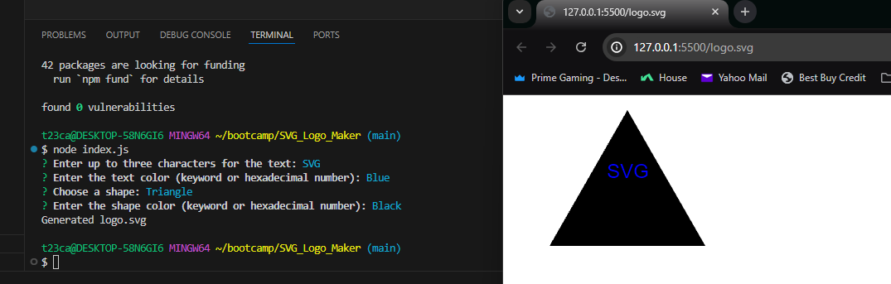

# SVG_Logo_Maker

This is a Node.js command-line application that generates a simple logo based on user input.

## Usage

1. Make sure you have Node.js installed on your machine.
2. Clone this repository git@github.com:tcarocci/SVG_Logo_Maker.git.
3. Navigate to the project directory.
4. Install dependencies by running `npm install`.
5. Run the application using `node index.js`.
6. Follow the prompts to enter text, text color, shape, and shape color.
7. Once completed, the generated SVG file (`logo.svg`) will be saved in the project root directory.
8. Either open in Live Server or find the file locationn and open there as well.

## Video Demonstration

[Link to Video Demonstration](https://app.screencastify.com/v3/watch/shk9iEAcoBYsKz8B9xV0)

## Additional Information

- The application uses Inquirer for collecting user input.
- Shape classes (Triangle, Circle, Square) are defined in the `lib/shapes.js` file.
- Jest is used for running unit tests.

## Screenshots

